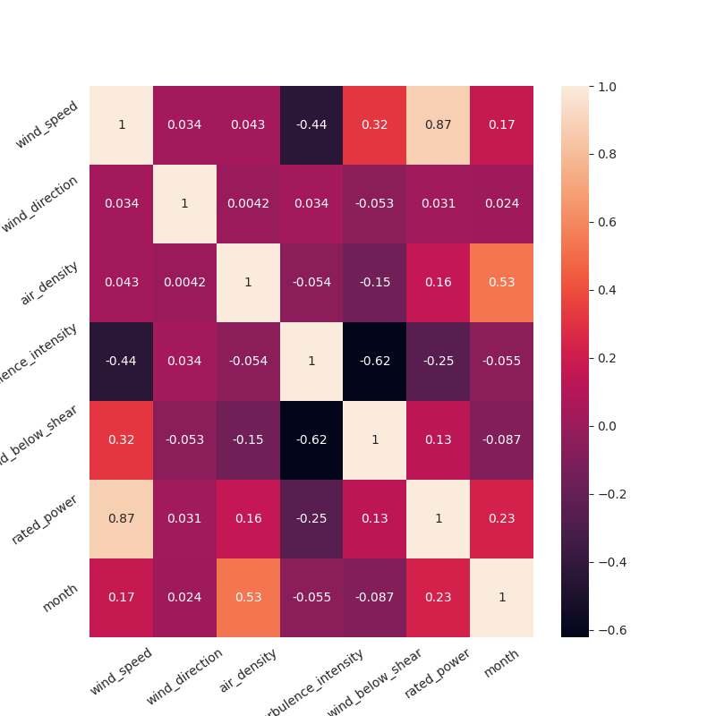
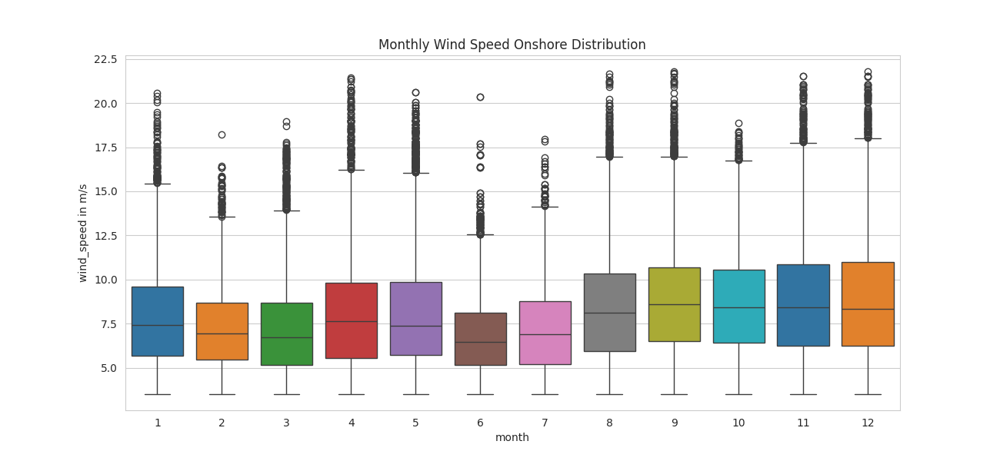
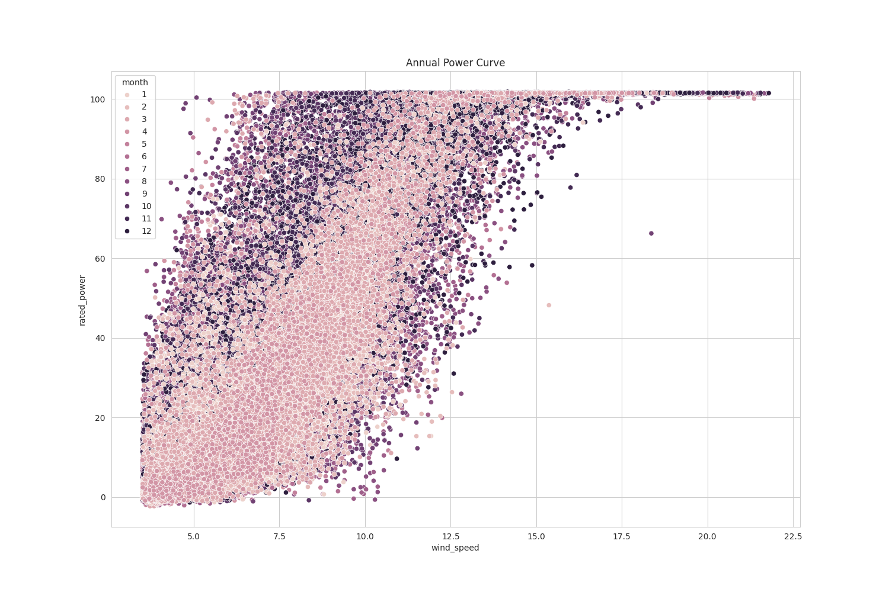
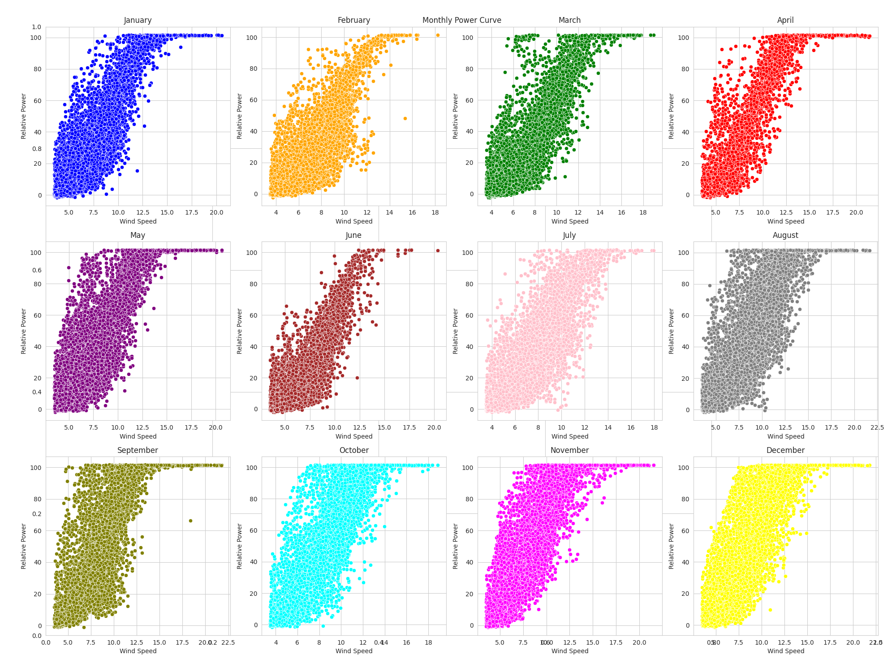
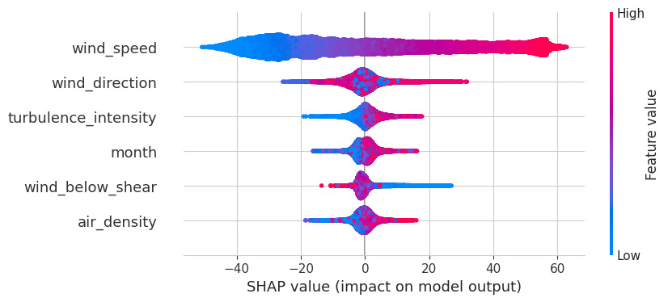

# Wind Farm

<!--  -->

## Introduction

One of the most discussed topics in the last decade is the efficiency and implementation of renewable energy sources. One of the problems with implementing renewable energy is the lack of knowledge about the power that will be generated by these sources, as they depend on non-constant means and the region where they are implemented. Therefore, having a forecast of the future generated power is very important.

## Objective

This work aims to forecast the wind power generation of four turbines over a one-year period. As shown in the figure at the beginning of this text, the curve representing this generation is not linear, thus excluding the use of linear machine learning (ML) models. Since this is a time series regression problem, we also cannot use cross-validation, as it would remove the bias found in some months' generation.

The work is divided as follows: 
- presentation of the dataset, along with a brief explanation of the data; 
- data analysis to find the best features for the application of ML models; 
- implementation of the ML models; conclusion of this work; 
- and a brief presentation of the next steps and encountered difficulties.

### Repository Layout

The file **main.ipynb** presents all the code and other analyses performed on the data. In the assets/img folder, you can find all the images used in this document. In the data/ folder, you will find the zip file with the original data and the six CSV files representing the turbines.

## [Dataset Description](https://zenodo.org/records/5516552)

The datasets provide information collected at 10-minute intervals from six turbines and three meteorological masts, arranged in six files associated with each turbine. The turbines are named WT1 through WT6, respectively. The data were collected at two wind farms: one offshore and one onshore.

- **Data Collection Periods:**
  - For WT1 and WT2: July 30, 2010, through July 31, 2011.
  - For WT3 and WT4: April 29, 2010, through April 30, 2011.
  - For WT5 and WT6: January 1, 2009, through December 31, 2009.

- **Location:** The data were collected from both offshore and inland wind farms.

- **Environmental Variables:** Seven environmental variables are available for the offshore wind farm (V, D, rho, H, I, Sa, Sb), while on the inland wind farm, humidity measurements and above-hub wind shear are not available, resulting in five variables (V, D, rho, I, Sb).

- **Association:** Each meteorological mast is associated with two wind turbines, meaning the environmental variables measured at a met mast are paired with the output power measurements of two associated turbines.

- **Meaning of variables** The variables were measured by sensors on the meteorological masts, while the output power (y) was measured at the wind turbines: 
    - V: wind speed;
    - D: wind direction;
    - rho: air density;
    - H: humidity;
    - I: turbulence intensity;
    - S: vertical wind shear;
    - Sa: above-hub height wind shear;
    - Sb: below-hub height wind shear.
  
## Methodology

As seen in the previous section, there are six data files, each representing a wind turbine (WT1 to WT6). For the data presentation below, it is necessary to understand which data were used. In this work, the data from four turbines, WT3 and WT4, were used, referred to as windfarm_Onshore. The same analyses were performed for the offshore turbines, WT5 and WT6, referred to as windfarm_Offshore, but they will not be presented in this document. All results can be found in the **main.ipynb** file.

We started the data analysis by identifying any missing or duplicate data. After this initial analysis, I like to begin with a heatmap of the variables to observe which ones have a higher correlation with the power data. This can be seen in the image below, specifically in the last row. We concluded that there is a strong correlation between power generation, wind speed and months. On the other hand, turbulence intensity has an inverse relationship with power generation.

Another interesting analysis is when we show the variation of Wind Speed and Air Density over the months using a boxplot. There is an identical behavior in these two datasets, where month 9 has the highest median for both and month 6 has the lowest. Another interesting point is the number of outliers we have in wind speed. For this work, we will not perform any treatment on these data.

To understand which method we should use for data prediction, it is necessary to understand how the power curve of a wind turbine works. The graph below shows an ideal form of active power generation. As we can see, this curve is not linear, so linear methods will perform poorly when trying to predict the generated power. Tree-based methods might perform better for these data.

Below is the real data graph. This is a scatter plot with two charts: one divided by month intensity for each generation, and another that separates generation by month for each chart. We can observe a higher intensity in the month with higher wind speed and lower intensity in the month with the lowest median.

## Applying XGBRegressor

The method that will be used is XGBRegressor. eXtreme Gradient Boosting (XGBoost) works by building a series of decision trees sequentially. Each tree is trained to correct the errors of the previous tree, iteratively adjusting to the residuals.

As explained by [Mario Filho](https://mariofilho.com/validacao-de-series-temporais-em-machine-learning-usando-python/#valida%C3%A7%C3%A3o-temporal-simples-com-ponto-fixo)
, validating a time series presents a pitfall when evaluating the method. Using techniques such as cross-validation or train_test_split removes some intrinsic characteristics of the data, thus worsening the model's predictability. This is so important that, as shown in the table below, if we are unaware of this, we might use cross-validation without hesitation.

The table below is ordered by RMSE, where, excluding the first two techniques, the best is Simple Temporal Validation with Fixed Point. Essentially, we separate the data of the months we want to train on, without altering them, and then make the prediction. For this test, the data was split in half, meaning that from January to June, the training data was used, and from July to December, the predictions were made.

| index_name        | R2 (%) | RMSE | MAE | WMAPE | male (%) | MAPE          |
|-------------------|--------|------|-----|-------|----------|---------------|
| cross_validation  | 93.72  | 7.96 | 5.50| 13.17 | 13.50    | 1.450405e+14  |
| normal_temporal   | 93.72  | 7.96 | 5.50| 13.17 | 13.50    | 1.450405e+14  |
| simple_temporal   | 86.16  | 10.99| 8.05| 21.85 | 21.97    | 2.838327e+14  |
| expansive_window  | 81.93  | 12.41| 8.76| 21.94 | 24.16    | 1.445954e+14  |
| sliding_window    | 80.18  | 13.02| 9.29| 23.22 | 26.77    | 2.117786e+14  |
| censorship        | 79.95  | 13.46| 9.75| 23.21 | 26.82    | 2.801625e+14  |

A library I just came across is SHAP, which aims to graphically show how the model evaluates each of the features used. The graph below shows data from the Temporal Validation with Fixed Point, where we can see that wind speed had a significant impact on the data predictions.

