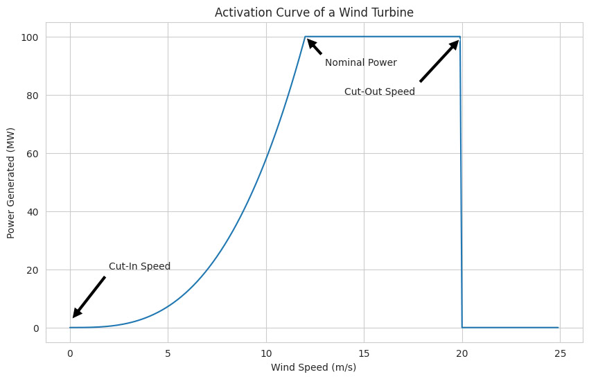

# Wind Farm

<!--  -->

## Introduction

One of the most discussed topics in the last decade is the efficiency and implementation of renewable energy sources. One of the problems with implementing renewable energy is the lack of knowledge about the power that will be generated by these sources, as they depend on non-constant means and the region where they are implemented. Therefore, having a forecast of the future generated power is very important.
 
## Objective

## [Dataset Description](https://zenodo.org/records/5516552)

The datasets provide information collected at 10-minute intervals from six turbines and three meteorological masts, arranged in six files associated with each turbine. The turbines are named WT1 through WT6, respectively. The data were collected at two wind farms: one offshore and one onshore.

- **Data Collection Periods:**
  - For WT1 and WT2: July 30, 2010, through July 31, 2011.
  - For WT3 and WT4: April 29, 2010, through April 30, 2011.
  - For WT5 and WT6: January 1, 2009, through December 31, 2009.

- **Location:** The data were collected from both offshore and inland wind farms.

- **Environmental Variables:** Seven environmental variables are available for the offshore wind farm (V, D, rho, H, I, Sa, Sb), while on the inland wind farm, humidity measurements and above-hub wind shear are not available, resulting in five variables (V, D, rho, I, Sb).

- **Association:** Each meteorological mast is associated with two wind turbines, meaning the environmental variables measured at a met mast are paired with the output power measurements of two associated turbines.

- **Meaning of variables** The variables were measured by sensors on the meteorological masts, while the output power (y) was measured at the wind turbines: 
    - V: wind speed;
    - D: wind direction;
    - rho: air density;
    - H: humidity;
    - I: turbulence intensity;
    - S: vertical wind shear;
    - Sa: above-hub height wind shear;
    - Sb: below-hub height wind shear.